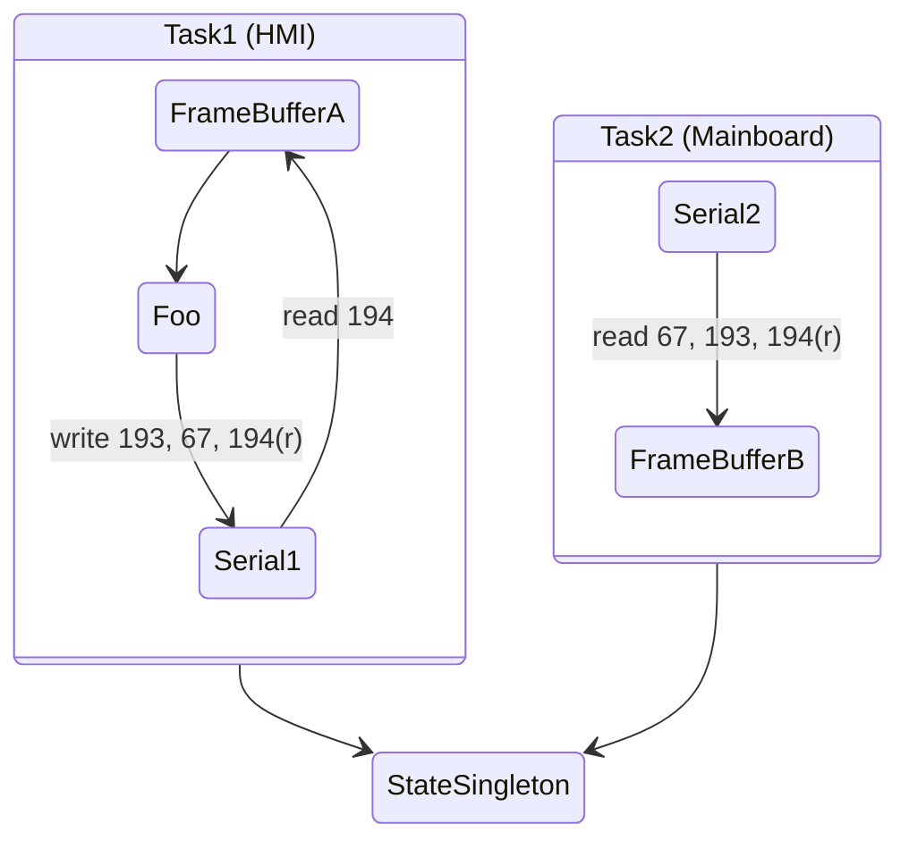

# Design

- Read 193, 67 from Mainboard
- Write 194 to Mainboard
- Read 194 from HMI
- Write 193, 67 to HMI
- OnChange, Update MQTT

```mermaid
stateDiagram-v2
    Task1: Task1 (HMI)
    state Task1 {
        
        FrameBufferA --> Foo: 
        Foo --> Serial1: write 193, 67, 194(r)
        Serial1 --> FrameBufferA: read 194
    }
    Task1 --> StateSingleton
    Task2: Task2 (Mainboard)
    state Task2 {
        Serial2 --> FrameBufferB: read 67, 193, 194(r)
        
    }
    Task2 --> StateSingleton
 
```