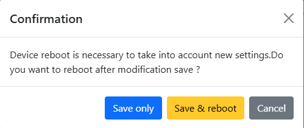

# AquaMQTT

AquaMQTT is designed for an ESP32 microcontroller running Arduino. The project offers two distinct operation modes: "
Listener" and "Man-in-the-Middle."

### Operation Modes

1. **Listener Mode:**

   - AquaMQTT acts as an observer, monitoring communication between a heat pump HMI controller and the heat pump main
     controller.
   - Parses the serial messages exchanged between the two controllers and publishes relevant data to specified MQTT
     topics (refer to [MQTT.md](../MQTT.md)).

2. **Man-in-the-Middle Mode:**
   - AquaMQTT intercepts and sits between the communication channels of the HMI controller and the main heat pump
     controller.
   - Parses the serial messages exchanged between the two controllers and publishes relevant data to specified MQTT
     topics (refer to [MQTT.md](../MQTT.md)).
   - Enables the modification of communication messages in both directions, allowing for the alteration of
     various parameters such as operation mode, water target temperature, and more.

## Getting Started

### Hardware Requirements

- [Arduino ESP32 Nano](https://docs.arduino.cc/hardware/nano-esp32)
- [AquaMQTT Board](../pcb/)

### Installation

1. Clone the AquaMQTT repository to your local machine.

   ```bash
   git clone https://github.com/tspopp/AquaMQTT.git
   ```

### Flashing

1. Install PlatformIO IDE

   https://platformio.org/install

2. Build the project using

   ```bash
   pio run -e arduino_nano_esp32
   ```

3. Connect the Arduino and upload the project filesystem to your microcontroller via USB

   ```bash
   pio run -t uploadfs -e arduino_nano_esp32
   ```

4. Connect the Arduino and upload the project to your microcontroller via USB

   ```bash
   pio run -t upload -e arduino_nano_esp32
   ```

**Note:** If you are using the cheaper esp32 [esp32-s3-devkit-c1](https://github.com/tspopp/AquaMQTT/issues/56) instead of the Arduino Nano ESP32, use the environment `esp32-s3-devkitc-1` instead of `arduino_nano_esp32`

### Configuration

1. Configure WiFi Settings:

From a computer identify wifi created by the esp32. It's name is `aquamqtt-XXXX` (XXXX is the four first character of the MAC address).

Connect to this network (no password required)

From a web browser access `192.168.4.1`

Enter your network SSID and password in the fields.


Save and reboot



2. Configure other Settings:

   Once Wifi settings are correct, determine IP adress of the device and enter it in a web browser.

   Then you'll be able to access to other settings, such as MQTT et AquaMqtt specific settings.
   (these settings are also avaible in step1 but rendering of web page is slower)

   Available settings from Web page:

   #### MQTT Settings

   - Server MQTT : IP address of MQTT broker (default : "localhost")
   - MQTT Server port : port of MQQT broker (default : 1883)
   - Username: username to connect to MQTT server, leave balnk if no user defined in MQTT broker (default : blank)
   - Password: password of MQTT username, leave balnk if no password defined in MQTT broker (default : blank)
   - ClientID: ID of the client in MQTT broker (useful for debug purpos) (default: aquamqtt)
   - Enable HomeAssisant Discovery : if enabled will allow automatic creation of sensor in HomeAssistant (default : true)
   - DiscoveryPrefix : prefix to allow discovery (default : "homeassistant/")

   #### AquaMQTT settings:

   - Mode : operation mode of aquaMQTT (MITM or LISTENER) (default:"Listener")
   - Heat Pump model name : name of the heat pump to display in HomeAssistant (default: "Atlantic Explorer v4")

### Over-The-Air Update

1. Determine the IP-Address of your AquaMQTT device

   **Note:** If you already have MQTT up and running, AquaMQTT will publish the IP-Address to `aquamqtt/stats/ipAddress`

2. Adapt `platformio.ini` accordingly:

   ```ini
   # uncomment the below lines to use over the air update
   upload_protocol = espota
   upload_port = 192.168.188.62
   ```

3. Upload
   ```bash
   pio run -t upload -e arduino_nano_esp32
   ```

## Contributions

Contributions to the AquaMQTT project are welcome. Feel free to open issues, submit pull requests, or provide feedback.

## License

This project is licensed under the Apache License 2.0.
