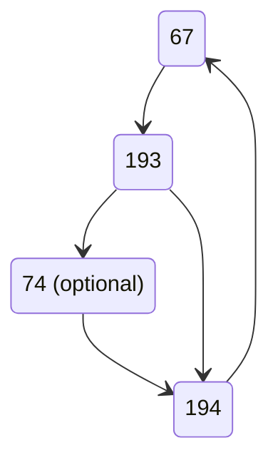
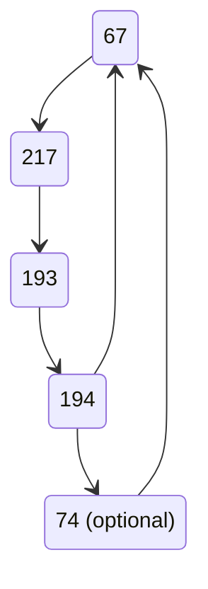
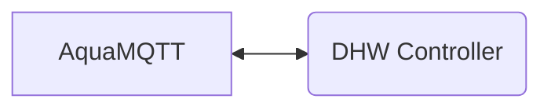
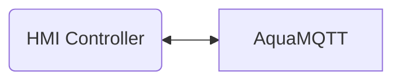
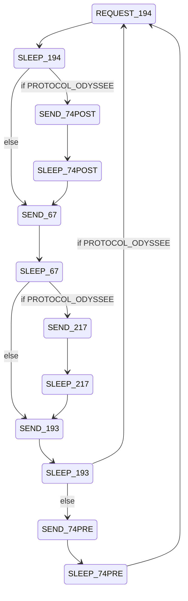

# MITM

## Message Sequence

### Legacy / Next

### Odyssee

## Controller Task

Is responsible for the communication the DHW Controller. Replicates the HMI Controller.

- Reads all controller messages and store message sequences from the controller e.g.
  - Legacy/Next: 67 - 193 - 74
  - Odysee: 67 - 217 - 193 
- If HMI trigger appears (194) check if it matches to the expected sequence and write HMI message to controller

## HMI Task

Is responsible for the communication with the HMI Controller. Replicates the Main Controller

- Replicates message sequence and frequency according to the protocol type
- Requests HMI Message (194) from the HMI Controller
- If message contains request for error message (74), emit requested error message if already available

### State Machine

- Protocol expects a new message on the bus every 100ms
- Therefore the sum of SLEEP and SEND State must be 100ms
- Depending on the Protocol we need to send the error message pre or post message 194
- Protocol Odyssee is the only known protocol with message id 217

