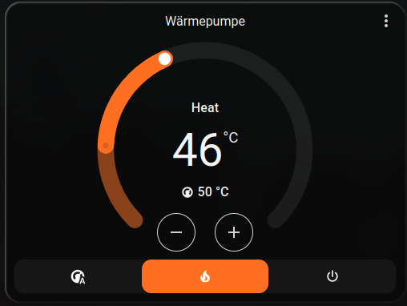
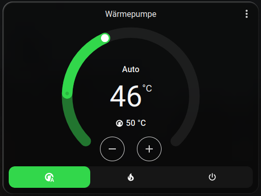
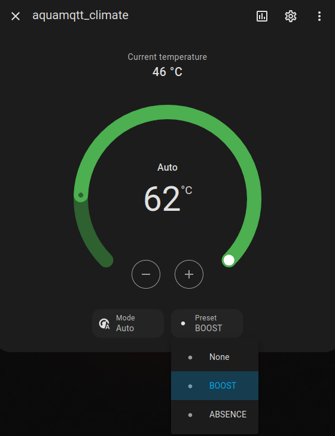

# Integrate AquaMQTT into HomeAssisant

## Automatic via MQTT Discovery

Since Release [v1.4.0](https://github.com/tspopp/AquaMQTT/releases/tag/v1.4.0) AquaMQTT supports the [MQTT Discovery](https://www.home-assistant.io/integrations/mqtt/#mqtt-discovery) protocol from HomeAssistant. Therefore, a new AquaMQTT device will automatically appear in your homeassistant instance, as soon as the following pre-conditions are fullfilled:

- [x] AquaMQTT is connected to the MQTT broker of your HomeAssistant instance
- [x] The correct home assistant mqtt prefix has been set and the MQTT discovery has been set to enabled within [Configuration.h](./AquaMQTT/include/config/Configuration.h) prior to flashing AquaMQTT on the Arduino.
- [x] The first valid message from the heat pump has been parsed successfully. Reason: There are different heat pump protocols and as soon the protocol version is known, we know the set of attributes available.

If all these conditions are fullfilled, you will find the AquaMQTT device at `Settings` -> `Device` -> `MQTT/Devices` within your HomeAssistant web interface.

## Manual by editing your own configuration.yaml

If you need full control over the entities read from AquaMQTT, you may directly edit the `configuration.yaml` file of your homeassistant installation. There is a file [./aquamqtt.yaml](./aquamqtt.yaml) within this repository, which acts as template for you to edit and included in your configuration file. 

Please note, that there might be more attributes not implemented by this example. For a full catalogue of MQTT topics and payloads inspect [./MQTT.md](./MQTT.md) or inspect the MQTT traffic produced by AquaMQTT.

#### Climate Entity for Manual Configuration

For users who prefer manual configuration and want more comprehensive climate control through Home Assistant climate cards, a `climate` entity can be added. This allows for dedicated climate control cards and integration for `solar optimization scripts` (e.g.:[PV_Excess_Control by HenrikW](https://github.com/InventoCasa/ha-advanced-blueprints/tree/main/PV_Excess_Control))




To integrate this, add the following entry to your `mqtt.yaml` file (assuming you have `mqtt.yaml` included in your `configuration.yaml` like this: `mqtt: !include mqtt.yaml`):

```yaml
- climate:
    name: "aquamqtt_climate"
    unique_id: "aquamqtt_climate"
    temperature_unit: C
    min_temp: 43
    max_temp: 60
    temp_step: 1

    # Current water temperature
    current_temperature_topic: "aquamqtt/main/waterTemp"
    current_temperature_template: "{{ value | float }}"

    # Target temperature (read)
    temperature_state_topic: "aquamqtt/hmi/waterTempTarget"
    temperature_state_template: "{{ value | float }}"

    # Target temperature (set)
    temperature_command_topic: "aquamqtt/ctrl/waterTempTarget"
    temperature_command_template: "{{ value | float }}"

    # Only use standard HVAC modes
    mode_state_topic: "aquamqtt/hmi/operationMode"
    mode_state_template: >
      
      {{ map.get(value, 'auto') }}

    mode_command_topic: "aquamqtt/ctrl/operationMode"
    mode_command_template: >
      
      {{ map.get(value, 'AUTO') }}

    modes:
      - "off"
      - "auto"
      - "heat"

    # Preset modes (must match device payloads exactly)
    preset_mode_state_topic: "aquamqtt/hmi/operationMode"
    preset_mode_command_topic: "aquamqtt/ctrl/operationMode"
    preset_modes:
      - "BOOST"
      - "ABSENCE"

    # Availability
    availability_topic: "aquamqtt/stats/lwlState"
    payload_available: "ONLINE"
    payload_not_available: "OFFLINE"
```
