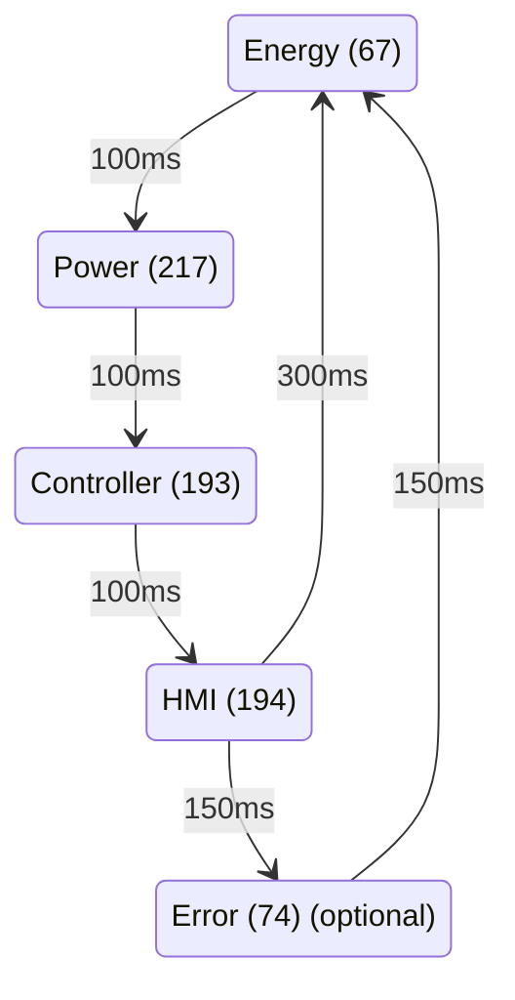

# Protocol (ODYSSEE)

Another heat pump protocol observed in https://github.com/tspopp/AquaMQTT/issues/68 with an _Atlantic Odyssee Pi_ heatpump (2015).

## Message Format

```
ID  LEN                                                                                                                                                                                            CRC
194 29   54 2    0  33  0  0   0  0   0   0   0  0   0  0   0 0 33 50 38 17 0 0 0 0 65 66  0 0                                                                                                      47
67  25   64 0  251  15  0  0   0  0 195   0   0  0 176 46   0 0  0  0  0  0 0 0 0 0                                                                                                                240
217 31    0 0  233   0  2  0 127  1 237 235  88  0  14  1 194 0  0  1  0  0 2 0 0 0  0  0  0  0  0  0                                                                                               26  
193 29   53  0  31   0 14  0  14  0  18   0   0  0  53  0  47 0  0  0  0  0 0 2 0 0  0  0 82 66                                                                                                      4  
74  68   46 24  54   0 75  0  23  0  24   0  35  0   0  0  54 0 55  0 65  3 0 0 0 0  0  0  0  0 81 38 0 0 152 0 0 0 123 12 0 0 47 13 0 0 152 26 0 0 46 1 0 0 221 46 58 12 1 24 0 0 0 0 0 0 0 0 43  128
```
## Identifier

Pattern is...
194 - 74 - 67 - 217 - 193



## Checksum

Is a regular XOR checksum on length field plus payload, same as we have observed in NEXT.

```
Message 194 from above, expected checksum is 47 (0x2F):
dec: 29 54  2  0 33  0  0  0  0  0  0  0  0  0  0  0  0 33 50 38 17  0  0  0  0 65 66  0  0
hex: 1d 36 02 00 21 00 00 00 00 00 00 00 00 00 00 00 00 21 32 26 11 00 00 00 00 41 42 00 00
```
Paste hex here: https://www.scadacore.com/tools/programming-calculators/online-checksum-calculator/ and locate CheckSum8 Xor which is `2F`

## Messages

### HMI Message (194)

| Byte Number | Example (dec) | Purpose/Function                    | Other Information                                               |
|-------------|---------------|-------------------------------------|-----------------------------------------------------------------|
| 0           | 29            | Length Field                        |                                                                 |
| 1           | 54            | Water Target Temperature            |                                                                 |
| 2           | 2             | Operation Type and Mode             |                                                                 |
| 3           | 0             | ?                                   | Changes to 4 in case we entered a programmed time window        |
| 4           | 33            | Anti-Legionella / Air-Duct          |                                                                 |
| 5           | 0             | Emergency-Mode On/Off               |                                                                 |
| 6           | 0             |                                     |                                                                 |
| 7           | 0             |                                     |                                                                 |
| 8           | 0             |                                     |                                                                 |
| 9           | 0             | Timer Window Remaining Time (hours) | In case we enter a programmed time window,                      |
| 10          | 0             | Timer Window Remaining Time (hours) | this will down count the remaining time within the time window. |
| 11          | 0             |                                     |                                                                 |
| 12          | 0             |                                     |                                                                 |
| 13          | 0             |                                     |                                                                 |
| 14          | 0             |                                     |                                                                 |
| 15          | 0             |                                     |                                                                 |
| 16          | 0             |                                     |                                                                 |
| 17          | 59            | Current Date                        |                                                                 |
| 18          | 50            | Current Date                        |                                                                 |
| 19          | 31            | Time Minutes                        |                                                                 |
| 20          | 9             | Time Hours                          |                                                                 |
| 21          | 0             |                                     |                                                                 |
| 22          | 0             |                                     |                                                                 |
| 23          | 0             |                                     |                                                                 |
| 24          | 0             |                                     |                                                                 |
| 25          | 65            |                                     |                                                                 |
| 26          | 66            | HMI Software Version                | Interpreted as ASCII, 66 == 'B'                                 |
| 27          | 0             | Error Number Requested              |                                                                 |
| 28          | 0             | Error Request Id                    |                                                                 |


## Help Required:

- *TODO: Installation Config: WP-Only, WP+ExtBoiler-Prio-WP,...*

### Main Message (193)

| Byte Number | Example (dec) | Purpose/Function              | Other Information               |
|-------------|---------------|-------------------------------|---------------------------------|
| 0           | 29            | Length Field                  |                                 |
| 1           | 53            | Water Temperature             |                                 |
| 2           | 0             |                               |                                 |
| 3           | 31            | Compressor Outlet Temperature |                                 |
| 4           | 0             |                               |                                 |
| 5           | 14            | Upper Evaporator Temperature  |                                 |
| 6           | 0             |                               |                                 |
| 7           | 14            | Lower Evaporator Temperature  |                                 |
| 8           | 0             |                               |                                 |
| 9           | 18            | Input Air Temperature         |                                 |
| 10          | 0             |                               |                                 |
| 11          | 0             |                               |                                 |
| 12          | 0             |                               |                                 |
| 13          | 53            | Upper Water Temperature       |                                 |
| 14          | 0             |                               |                                 |
| 15          | 47            | Lower Water Temperature       |                                 |
| 16          | 0             |                               |                                 |
| 17          | 0             | Picture Bitmask / States      |                                 |
| 18          | 0             | Fan Speed PWM 0-100%          |                                 |
| 19          | 0             |                               |                                 |
| 20          | 0             |                               |                                 |
| 21          | 0             |                               |                                 |
| 22          | 2             |                               |                                 |
| 23          | 0             |                               |                                 |
| 24          | 0             |                               |                                 |
| 25          | 0             |                               |                                 |
| 26          | 0             |                               |                                 |
| 27          | 82            |                               |                                 |
| 28          | 66            | Controller Software Version   | Interpreted as ASCII, 66 == 'B' |

##### Byte No 17: Picture Bitmask

Findings...

```
0dec   | 0000 0000: Nothing
1dec   | 0000 0001: Heating Element
24dec  | 0001 1000: Fan is turned on (observed via testmode)
26dec  | 0001 1010: Heatpump + Fan
27dec  | 0001 1011: Heatpump + Heating Element
32dec  | 0010 0000: Defrost
56dec  | 0011 1000: Fan + Defrost
58dec  | 0011 1010: Heatpump + defrost
```

### Energy Message (67)

| Byte Number | Example (dec) | Purpose/Function         | Other Information                 |
|-------------|---------------|--------------------------|-----------------------------------|
| 0           | 25            | Length Field             |                                   |
| 1           | 67            |                          |                                   |
| 2           | 0             |                          |                                   |
| 3           | 81            | ?                        | Unknown Upcounting Value (Hours?) |
| 4           | 16            | ?                        | Unknown Upcounting Value (Hours?) |
| 5           | 0             |                          |                                   |
| 6           | 0             |                          |                                   |
| 7           | 0             |                          |                                   |
| 8           | 0             |                          |                                   |
| 9           | 198           | Total heat element Hours |                                   |
| 10          | 0             | Total heat element Hours |                                   |
| 11          | 0             | Total heat element Hours |                                   |
| 12          | 0             | Total heat element Hours |                                   |
| 13          | 6             | Total Heatpump Hours     |                                   |
| 14          | 47            | Total Heatpump Hours     |                                   |
| 15          | 0             | Total Heatpump Hours     |                                   |
| 16          | 0             | Total Heatpump Hours     |                                   |
| 17          | 0             |                          |                                   |
| 18          | 0             |                          |                                   |
| 19          | 0             |                          |                                   |
| 20          | 0             |                          |                                   |
| 21          | 0             |                          |                                   |
| 22          | 0             |                          |                                   |
| 23          | 0             |                          |                                   |
| 24          | 0             |                          |                                   |

### Power Message (217)

| Byte Number | Example (dec) | Purpose/Function            | Other Information |
|-------------|---------------|-----------------------------|-------------------|
| 0           | 31            | Length Field                |                   |
| 1           | 218           | Amperage / Current (A)      | 2,18A             |
| 2           | 0             | Amperage / Current (A)      |                   |
| 3           | 237           | Voltage Grid (V)            | 237 V             |
| 4           | 0             | Voltage Grid (V)            |                   |
| 5           | 7             | Power Consumption Total (W) | 519 W             |
| 6           | 2             | Power Consumption Total (W) |                   |
| 7           | 68            |                             |                   |
| 8           | 1             |                             |                   |
| 9           | 139           | Total Energy (Wh)           | 5.865.611 Wh      |
| 10          | 128           | Total Energy (Wh)           |                   |
| 11          | 89            | Total Energy (Wh)           |                   |
| 12          | 0             | Total Energy (Wh)           |                   |
| 13          | 14            |                             |                   |
| 14          | 1             |                             |                   |
| 15          | 200           |                             |                   |
| 16          | 0             |                             |                   |
| 17          | 0             |                             |                   |
| 18          | 1             |                             |                   |
| 19          | 0             |                             |                   |
| 20          | 0             |                             |                   |
| 21          | 2             |                             |                   |
| 22          | 0             |                             |                   |
| 23          | 0             |                             |                   |
| 24          | 0             |                             |                   |
| 25          | 0             |                             |                   |
| 26          | 0             |                             |                   |
| 27          | 0             |                             |                   |
| 28          | 0             |                             |                   |
| 29          | 0             |                             |                   |
| 30          | 0             |                             |                   |

### Error Message (67)

| Byte Number | Example (dec) | Purpose/Function           | Other Information       |
|-------------|---------------|----------------------------|-------------------------|
| 0           | 68            | Length Field               |                         |
| 1           | 60            | Error Request Id           |                         |
| 2           | 24            | Error Code                 |                         |
| 3           | 47            | Eas chaude                 |                         |
| 4           | 0             | ?                          |                         |
| 5           | 73            | Refoulment compresseur     |                         |
| 6           | 0             | ?                          |                         |
| 7           | 20            | Evaporator haut            |                         |
| 8           | 0             | ?                          |                         |
| 9           | 19            | Evaporator bas             |                         |
| 10          | 0             | ?                          |                         |
| 11          | 35            | Air entrant                |                         |
| 12          | 0             | ?                          |                         |
| 13          | 0             | ?                          |                         |
| 14          | 0             | ?                          |                         |
| 15          | 47            | ECS haut                   |                         |
| 16          | 0             | ?                          |                         |
| 17          | 46            | ECS bas                    |                         |
| 18          | 0             | ?                          |                         |
| 19          | 97            | ?                          |                         |
| 20          | 2             | ?                          |                         |
| 21          | 0             | ?                          |                         |
| 22          | 0             | ?                          |                         |
| 23          | 0             | ?                          |                         |
| 24          | 0             | ?                          |                         |
| 25          | 0             | ?                          |                         |
| 26          | 0             | ?                          |                         |
| 27          | 0             | ?                          |                         |
| 28          | 0             | ?                          |                         |
| 29          | 130           | Tps fonct. comp 1er dem    |                         |
| 30          | 28            | Tps fonct. comp 1er dem    |                         |
| 31          | 0             | Tps fonct. comp 1er dem    |                         |
| 32          | 0             | Tps fonct. comp 1er dem    |                         |
| 33          | 125           | Tps fonct. AE 1er dem      |                         |
| 34          | 0             | Tps fonct. AE 1er dem      |                         |
| 35          | 0             | Tps fonct. AE 1er dem      |                         |
| 36          | 0             | Tps fonct. AE 1er dem      |                         |
| 37          | 158           | Nb. cycle fonct. PAC       |                         |
| 38          | 9             | Nb. cycle fonct. PAC       |                         |
| 39          | 0             | Nb. cycle fonct. PAC       |                         |
| 40          | 0             | Nb. cycle fonct. PAC       |                         |
| 41          | 48            | Nb. cycle fonct. FAN       |                         |
| 42          | 10            | Nb. cycle fonct. FAN       |                         |
| 43          | 0             | Nb. cycle fonct. FAN       |                         |
| 44          | 0             | Nb. cycle fonct. FAN       |                         |
| 45          | 131           | Nb. cycle fonct. VGC       |                         |
| 46          | 20            | Nb. cycle fonct. VGC       |                         |
| 47          | 0             | Nb. cycle fonct. VGC       |                         |
| 48          | 0             | Nb. cycle fonct. VGC       |                         |
| 49          | 0             | Nb. cycle fonct. AE        |                         |
| 50          | 1             | Nb. cycle fonct. AE        |                         |
| 51          | 0             | Nb. cycle fonct. AE        |                         |
| 52          | 0             | Nb. cycle fonct. AE        |                         |
| 53          | 6             | Date Day and Month         | Same Formula as in NEXT |
| 54          | 43            | Date Year                  | Same Formula as in NEXT |
| 55          | 26            | Time Minutes               |                         |
| 56          | 14            | Time Hours                 |                         |
| 57          | 1             | ?                          |                         |
| 58          | 3             | ? Valeur consigne a justée |                         |
| 59          | 0             | ?                          |                         |
| 60          | 0             | ?                          |                         |
| 61          | 0             | ?                          |                         |
| 62          | 0             | ?                          |                         |
| 63          | 0             | ?                          |                         |
| 64          | 0             | ?                          |                         |
| 65          | 0             | ?                          |                         |
| 66          | 0             | ?                          |                         |
| 67          | 32            | Nombre d'apparition        |                         |

