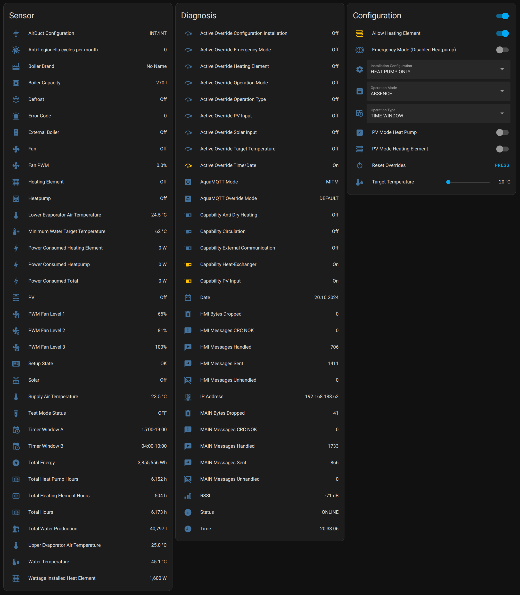
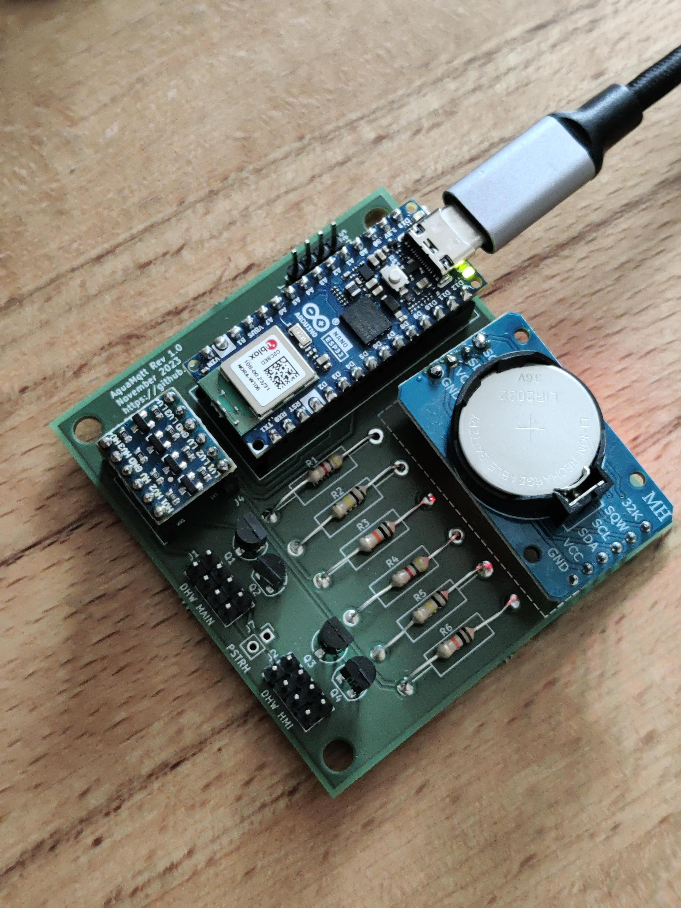
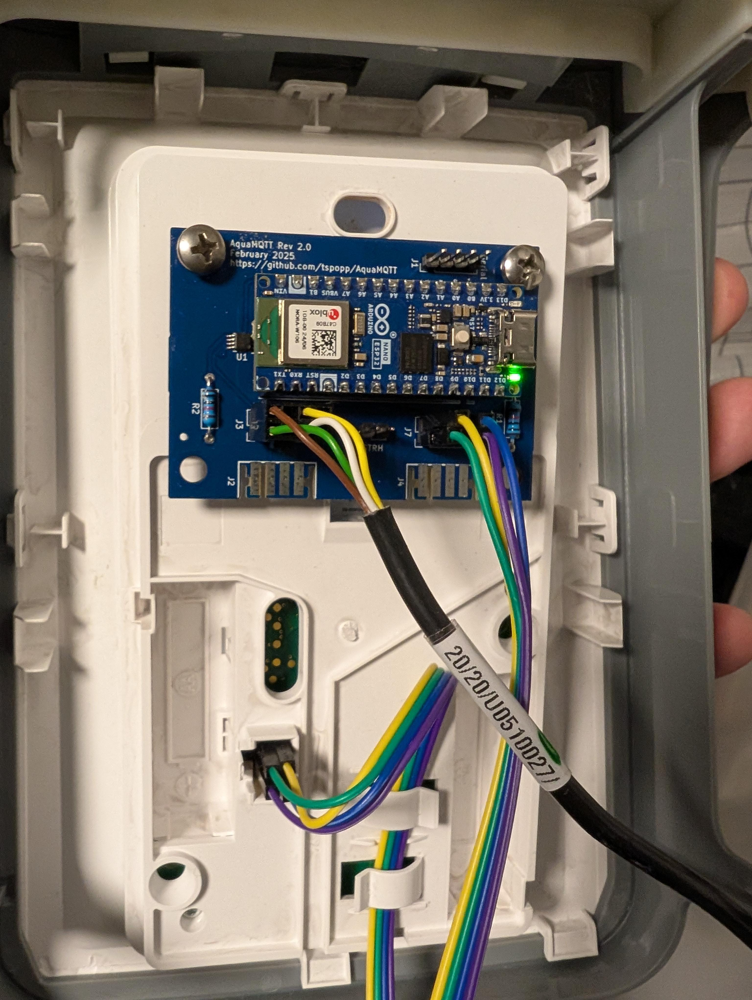

# AquaMQTT

 

AquaMQTT is a project designed to monitor and control your DHW heat pump locally using MQTT.

## Features

- Access sensor data and operational states from your heat pump.
- Control the heat pump: Set operational states e.g. water temperature and operation modes.
- [Automate the behavior of your heat pump according to your local energy production or energy availability](/README-PV.md)
- Easily integrate AquaMQTT with smart home systems like [Home Assistant](https://www.home-assistant.io/).

   

## Compatible Devices

AquaMQTT has been designed and tested with the [Windhager AquaWin Air3](https://www.windhager.com/en/products/hot-water-tanks/aquawin-air3/) DHW heat pump. While specifically tailored to this model, it has been proofen that AquaMQTT is compatible to similar heat pumps manufactured by the [Groupe Atlantic](https://www.groupe-atlantic.fr/) and branded for various companies such as:

- [Atlantic Explorer](https://www.atlantic-comfort.com/Water-Heaters/Heat-pump-water-heaters/Explorer)
- [Atlantic Calypso](https://atlantic-comfort.com/products/domestic-hot-water/heat-pump-water-heaters/calypso-vm)
- [Austria Email Explorer](https://www.austria-email.de/produkte/waermepumpensysteme/waermepumpen-trinkwasser/explorer-evo-2/)
- [Panasonic DHW270](https://www.aircon.panasonic.eu/CH_de/model/paw-dhw270f/)
- [Sauter Confort Pagosa Green](https://www.confort-sauter.com/chauffe-eau/pagosa-green)
- [Thermor Aeromax](https://www.thermor.com/our-solutions/renewable-energy-solutions/heat-pump-water-heaters/aeromax-premium)

A list of community proofen compatible devices is [here](./DEVICES.md).

## How does it work?

AquaMQTT facilitates communication between the HMI controller and the main controller of your heat pump. The project intercepts the serial messages exchanged between these controllers, extracts and parses identified values, and publishes them via [MQTT](./MQTT.md). For a detailed description of the heat pump's serial protocol, refer to [PROTOCOL.md](./PROTOCOL.md).

To achieve this communication interception, an Arduino-based microcontroller is introduced between the communication lines of the HMI controller and the main controller.

AquaMQTT not only monitors the heat pump's status but also provides the capability to control it by modifying the messages originating from the HMI controller. This allows you to set operational states, such as water temperature and operation modes, directly through AquaMQTT.

## Getting Started

- [Hardware Requirements](/pcb) 

- [Software Installation](AquaMQTT/README.md)

- [Heatpump Modification](./WIRING.md)

## Why not using cozytouch / io-homecontrol?

Unfortunately, I had no success pairing those solutions with my Windhager branded heatpump. Moreover, this solution is independent from any manufacturer backends and therefore running entirely within your private local area network. 

## Further Reading

- [HomeAssistant Integration](./HOMEASSISTANT.md)

- [Troubleshooting / F.A.Q](./TROUBLESHOOTING.md)

- [Compatible Devices](./DEVICES.md)
 
- [Heat pump serial protocol (LEGACY)](./PROTOCOL.md)

- [Heat pump serial protocol (NEXT)](./PROTOCOL_NEXT.md)

- [Heat pump serial protocol (ODYSSEE)](./PROTOCOL_ODYSSEE.md)

- [Available MQTT Topics and Payloads](./MQTT.md)

- [Utilize excess local energy using PV modes](./README-PV.md)

## References

- 🇫🇷 https://forum.hacf.fr/t/integration-dun-chauffe-eau-atlantic-explorer-en-mqtt/40493/6
- 🇳🇱 https://gathering.tweakers.net/forum/list_messages/2116816/78
- 🇩🇪 https://forum.iobroker.net/topic/61801/skript-atlantic-w%C3%A4rmepumpe-%C3%BCber-cozytouch-abfragen/74

