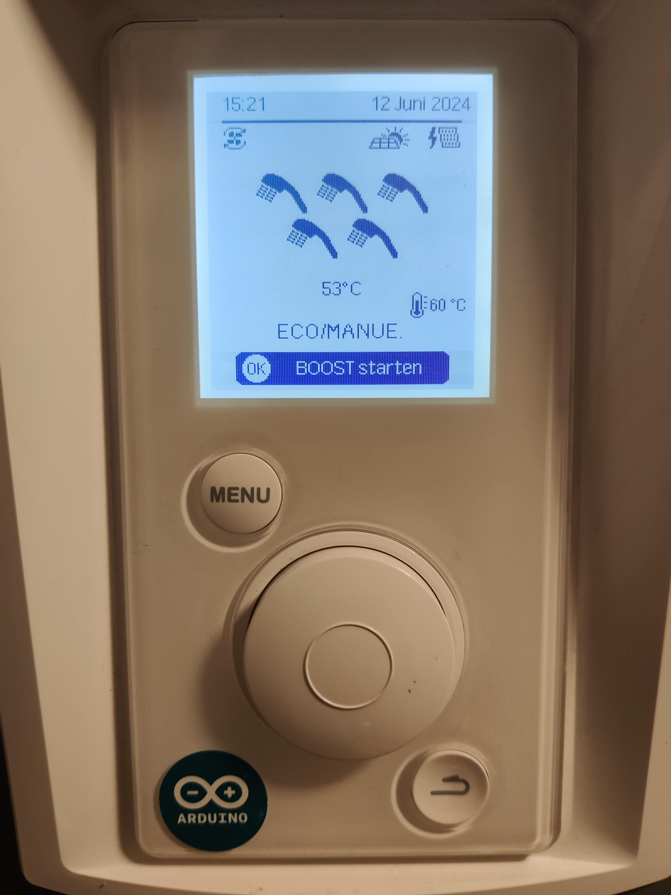
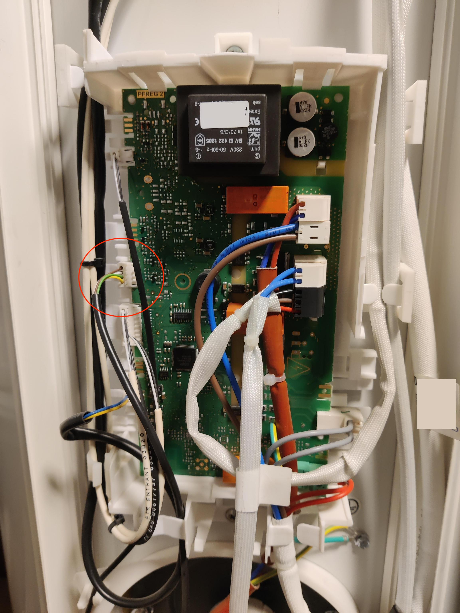
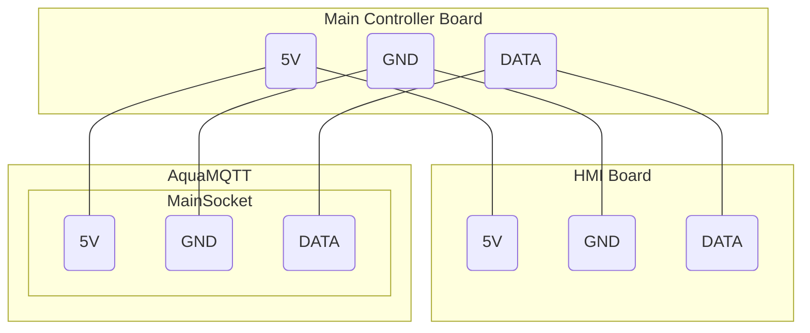

# Troubleshooting / F.A.Q.

### Q: How to check if my heat pump is supported?

Well, unfortunately there is no way to determine this upfront, but there are a few indicators which give you some hints
towards compatibility:

1.) The heat-pump is build by the Groupe Atlantic and/or has been recently [tested successfully](./README.md).

2.) The heat-pumps HMI controller looks very familiar to these:




3.) The main controller board installed in the heat-pump looks similar to these:



### Q: What is the difference between Listener and MITM Mode?

In Listener mode AquaMQTT will not alter the communication between the HMI and the main controller of the heat-pump. It is just parsing the communication and providing identified values to MQTT. In MITM mode AquaMQTT is sitting in the middle of the main and HMI controller, forwarding either original or modified messages depending on any overrides set by MQTT.

### Q: How to check if my heat pumps serial protocol is compatible to AquaMQTT?

AquaMQTT implements the heat-pumps serial protocol analyzed from an AquaWin Air3 heat-pump controller. It is possible that the Group Atlantic will change or adapt the protocol in newer products (> 2024) and AquaMQTT will be
incompatible to these.

To check if the connection to your heat-pump is good and the protocol is parsed accordingly:

1.) Use the LISTENER mode of AquaMQTT

2.) Intercept the GND and DATA wire of your heatpump and connect it to the MAIN Input of the AquaMQTT board:

a.) Using Passthrough Jumper as described in [WIRING.md](./WIRING.md)

or 

b.) by intercepting the message bus directly using custom wiring:



3.) Inspect the MQTT attributes `msgHandled`, `droppedBytes`, `msgSent` and `msgCRCNOK`.

**Note ⚠:** These MQTT attributes are disabled by default and have to be enabled within `Configuration.h`. Locate `MQTT_PUBLISH_SERIAL_STATISTICS` and set it to `true`.

- If the connection is
  good, `droppedBytes` will remain at very low amount and do not rise any further. A few dropped bytes during the
  initial
  protocol sync are expected. If the dropped bytes value is increasing over time, it means that AquaMQTT cannot sync to
  the heat-pump
  protocol and drops unexpected bytes or even entire messages. This is either due to connectivity issues or due to an unexpected,
  different protocol.

- The CRC message counter `msgCRCNOK` is counting up for each message which has been identified correctly, but has been
  dropped due to an CRC mismatch. If your connection is good, this counter will stay at a value of `0` for a very long
  time. If this counter is rising, there might be connectivity issues or a different heatpump protocol using a
  different CRC mechanism.

- The value `msgHandled` shall be rising over time if the connection is good. If this value stays at `0` there are most likely connectivity issues or the heat pump protocol is not (yet) supported.

### Q: AquaMQTT is connected to MQTT, but I don't see any values from the heatpump?

See above

### Q: Why does the HMI controller don't reflect changes made through MQTT in MITM Mode?

Since AquaMQTT is sitting in the middle between the heat-pumps MAIN and HMI controller, we can technically just alter
the communication / protocol between these entities. If for example the target temperature set by the HMI controller is
52°C, AquaMQTT may override the target temperature to 60°C before transferring the message to the main controller.

Since there is no protocol to tell the HMI controller that there was an override to 60°C, the HMI controller will still
display 52°C.

**The only true heatpump state is therefore provided by MQTT.**

### Q: My heatpump has just three wires instead of four. How to connect this?

It seems that depending on your heat-pump brand and model there are sometimes four and three wires. AquaMQTT is fine with three wires, as long as you identify 5V, GND and DATA and connect it to the right connectors of the AquaMQTT board. You may find additional help in the issues raised from users giving feedback. See proofen devices in [README.md](./README.md).

### Q: Why do I need the HMI controller? Do I have to connect the HMI controller?

In both of AquaMQTT current implemented OperationModes `LISTENER` and `MITM` it is expected to have an HMI controller
connected, since AquaMQTT is either just listening or forwarding original or modified messages emitted by the heat-pump
controllers.

Technically it would be feasible to build another OperationMode without the need for the original HMI controller, but
since we do not have a full understanding of the serial protocol (yet), it would imply some risk by not implementing some
unidentified attributes.

### Q: Which time and date is used? The one from HMI controller or the one from AquaMQTT?

In the original setup, the HMI controller is the time master and provides time and date to the main controller. Since the hmi controller does not have a backup battery, it looses date and time as soon as the heat-pump is disconnected from the means. If AquaMQTT is installed, it can be configured to be the new time master. In this case AquaMQTT is always providing the date and time fetched from an NTP time server to the main controller. Since the HMI controller is not aware of this override, it will still display an error message - but the heat pump will work as expected.

### Q: Why are there so few controllable attributes? Why not adding xyz?

Technically, any overrides of the protocol and therefore full controllability is possible. If you need more control
functionalities, just rise an issue or even an PR.

### Q: I want to debug the heat-pump protocol and help identifying more attributes, what is the best approach?

If AquaMQTT is already working as expected and parsing previously identified messages, the best way to identify more attributes is by tracing and recording raw messages over time. The output of raw messages to MQTT can be enabled by changing the following configuration value within `Configuration.h`:

```C++
/**
 * Choose to publish raw messages represented as hex-string on debug mqtt topics
 */
constexpr bool DEBUG_RAW_SERIAL_MESSAGES = true;
```

As soon as this flag enabled, AquaMQTT will emit raw messages (without CRC) as hex string via MQTT for all known messages.

There is a [python script](./tools) which subscribes all the debug topics and writes the the messages to files in a HEX and a DEC representation together with a timestamp:

```
2024-05-28 21:25:13.822113,35 18 2 65 252 0 240 32 240 6 60 16 16 24 255 255 0 6 188 48 25 21 0 0 255 0 9 66 0 0 255 255 255 255 255
2024-05-28 21:25:14.805612,35 18 2 65 252 0 240 32 240 6 60 16 16 24 255 255 0 7 188 48 25 21 0 0 255 0 9 66 0 0 255 255 255 255 255
```

*The python script has to be modified to connect to your mqtt broker, with your mqtt broker credentials etc.*

Afterwards you can inspect changing values over time and identify attributes by making changes to your HMI controller. If you identifiy something new which is not documented within [PROTOCOL.md](./PROTOCOL.md) yet, please create an issue or even an PR.

### Q: I think my heat-pump uses an incompatible serial protocol? What can I do?

If you already have the AquaMQTT Board installed and available, you can set it to LISTENER Mode and install [AquaDebug](./tools/AquaDebug/) to collect unmodified serial data traces from the heat-pump controller. If there are no other hardware and or connectivity related issues you should be able to identify the [heat-pump messages](./PROTOCOL.md) within the raw data. If the messages differ from the expected protocol, open up an github issue to discuss further.
