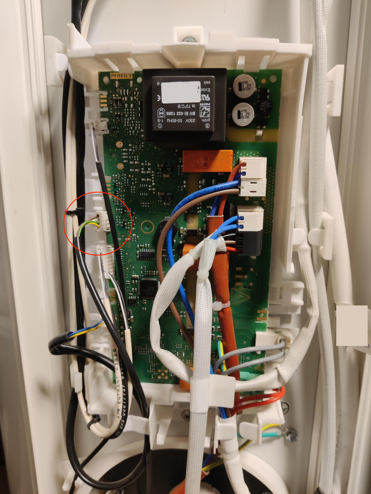
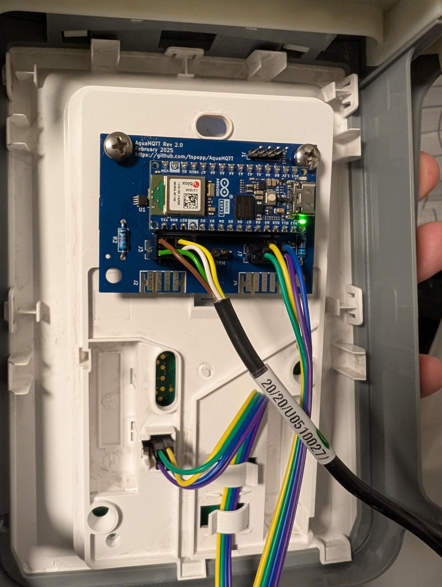

# WIRING

**Important Notice:** By using this open-source project, you acknowledge and agree that:

1. **No Warranty:** This project is provided "as is" without any warranty, express or implied. Use it at your own risk.

2. **Possibility of Warranty Void:** The use of this project may involve modifying or interacting with other software, hardware, or systems. Such actions could potentially void warranties provided by manufacturers or vendors.

3. **Your Responsibility:** It is your responsibility to review and comply with the warranty terms of any products or systems affected by the use of this project. You should be aware that using third-party software, including this project, may have implications on your warranty coverage.

4. **No Liability:** The project contributors and maintainers shall not be liable for any damages or issues arising from the use of this project, including but not limited to warranty-related matters.

## Preparation

**IMPORTANT: Turn off the heat pump and disconnect power supply.**

Disassemble the heatpump as described within the chapter "**Opening the product for maintenance**" section from the [official manual](https://www.windhager.com/fileadmin/PDF_Documents/Produktprospekte/Bedienungsanleitung_AquaWIN_Air_273-203.pdf), pg 153:

*Accessing the controls compartment is enough:*

1. Detach the lower plug of the column by releasing its clip.
2. Loosen the pair of screws securing each side of the column.
3. Lower the column approximately ten centimeters to ensure an unobstructed control panel.
4. Depress the center of the column to unlock and detach it from the guide rails.

## Overview

Once disassembled you can locate the connector on the back side of the HMI Controller...


... which is connected to the following port of the Main Controller:



- VCC 5V (green)
- GND (red/brown)
- TX/RX, Logical 5V (white)
- Unknown (yellow)

The AquaMQTT Board intercepts the data line (white) and is using the provided VCC/GND as power supply.

## Mounting

Place the AquaMqtt Board to the back side of the hmi controller and connect the DHW HMI Connector with the original HMI controller. Match the connections accordingly:


## Wiring

### Revision 1.0

Connect the original connector cable to the DHW Main Connector on the AquaMqtt Board as shown here:


### Revision 2.0



### Man-In-The-Middle Mode

The man in the middle mode is the default mode of AquaMQTT and the intended purpose of AquaMQTT. In this mode you are able to control the heatpump, independent from the settings made within the HMI controller of the heatpump. By default, settings from the HMI controller are forwarded to the main controller and may be optionally overriden using MQTT commands.

1. Connect the original cable coming from the main controller to the AquaMQTT Boards Connector `DHW main`.

    **Make sure that green (5V) and brown (GND) is facing towards `J1` (rev 1.0) / `J3` (rev 2.0) on the board**

2. Connect the hmi controller to the AquaMQTT Boards Connector `DHW HMI` using your customized cable or jumper cable. 

### Listener Mode

In listener mode, the AquaMQTT board expects to read any serial information exchanged by the DHW HMI Controller and DHW Main Controller on the AquaMQTT Boards Connector `DHW main`. The intended way of using listener mode is:

1. Set the Passthrough (PSTRH) Jumper on the AquaMQTT Board.

2. Connect the cables as mentioned in Man-In-The-Middle Board.

3. Make sure the Configuration.h file has set:

    ```c++
    constexpr EOperationMode OPERATION_MODE = EOperationMode::LISTENER;
    ```
