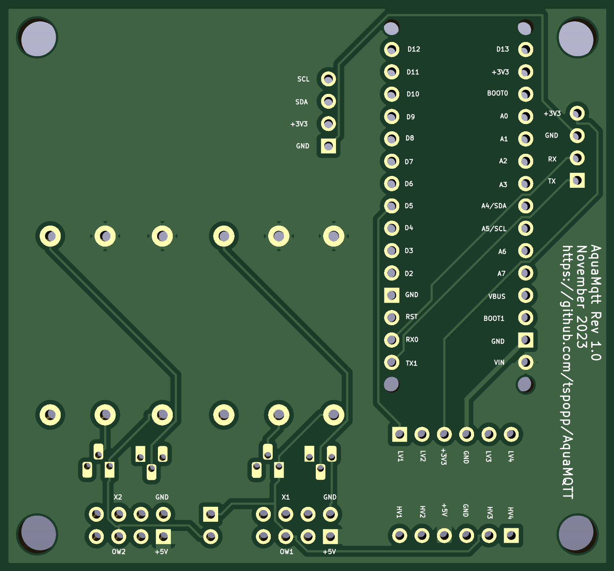

# AquaMqtt PCB Board

The AquaMQTT PCB Board is intended to be installed between the communication wires of the DHW HMI Controller and the DHW
Mainboard. To enable the communication to both HMI Controller and DHW Mainboard, the board provides two
individual [USART entities in One-Wire Mode](https://ww1.microchip.com/downloads/en/AppNotes/USART-in-One-Wire-Mode-ApplicationNote-DS00002658.pdf).
The Arduino ESP32 on the board runs AquaMQTT, providing communication via WiFi/MQTT while being powerful enough to
handle any time critical USART communication with the heat pumps hmi controller and main board.

The boards are designed using [Kicad](https://www.kicad.org/). If you want to edit the layout, you may need to install an
additional [Arduino Kicad library](https://github.com/Alarm-Siren/arduino-kicad-library) before opening/editing the
project.

## Changelog

| Version | Description                                       |
|---------|---------------------------------------------------|
| 2.0     | RAST Sockets, SMD SN74LVC2T45, Pre-assembly Ready |
| 1.0     | Initial Design, Self-Soldering                    |

## Revision 2.0

This revision fixes an issue, where [certain heatpumps](https://github.com/tspopp/AquaMQTT/issues/67) were not able to communicate due to a very sensitive serial link and changes of impedance. The Logic-Level-Converter and the one-wire USART circuit have been replaced by two [SN74LVC2T45](https://www.ti.com/lit/ds/symlink/sn74lvc2t45.pdf?ts=1740403453841&ref_url=https%253A%252F%252Fwww.ti.com%252Fproduct%252Fde-de%252FSN74LVC2T45). Thanks to [@Arrnooo](https://github.com/Arrnooo) for debugging, verifying and providing a new design proposal.

Additionally, this revision adds optional RAST sockets. Thanks to [@tukutt](https://github.com/tukutt) for providing the design and custom adapters, originally used with revision 1.0 of the AquaMQTT board (see below).

### Ordering / Self Soldering

This board uses tiny SMD SSOP parts (SN74LVC2T45) so self-soldering is most probably an issue. This revision is meant to be bought pre-assembled from [JLCPCB](https://jlcpcb.com/)

1. Upload `AquaMQTT_Board_Revision_v2.zip` as *gerber file*
2. Enable "PCB Assembly"
3. Proceed and upload `AquaMQTT_Board_Revision_v2_BOM.csv` as *BOM*
4. Proceed and upload `AquaMQTT_Board_Revision_v2_CPL.csv` as *CPL*
5. Verify matched parts (should be good out of the box)
6. Verify component placement (should be good out of the box)

### Parts

| Item                                                                                                                                                                                     | Count | Estimated Cost |
|------------------------------------------------------------------------------------------------------------------------------------------------------------------------------------------|-------|----------------|
| Pre-Soldered AquaMQTT Board (Revision 2.0)  (https://jlcpcb.com/)                                                                                                                        | 1x    | ~ 6 $          |
| [Arduino Nano ESP32](https://docs.arduino.cc/hardware/nano-esp32) with Headers (ABX00083). Note: Community suggested [cheaper alternative](https://github.com/tspopp/AquaMQTT/issues/56) | 1x    | ~ 5-20 €       |

## Revision 1.0

**First revision, which is still good to use. There is no need to replace it with revision 2.0 in case it works for your heatpump.**

An optional DS3231 Real Time Clock might be added to the board. This might be handy in case AquaMQTT will be ever used without any HMI at all. It would ensure a recovery with correct date and time after power outage and without WiFi.
**Adding a RTC Module is experimental and untested!**

### RAST vs. 2x4 Connector

Your [heat pump](./../DEVICES.md) may use a different connector such as the Thermor Aeromax 5. Happily [@tukutt](https://github.com/tukutt) designed an [adapter pcb](https://oshwlab.com/tukutt/aquamqtt-original-pcb-to-rast-co) to connect those heatpumps without cutting any cables. Read more about this in [#51](https://github.com/tspopp/AquaMQTT/issues/51).

### BOM

| Item                                                                                                                                                             | Count | Estimated Cost |
|------------------------------------------------------------------------------------------------------------------------------------------------------------------|-------|----------------|
| AquaMqtt PCB Board (e.g. via AISLER.net)                                                                                                                         | 1x    | ~ 7 €          |
| [Arduino Nano ESP32](https://docs.arduino.cc/hardware/nano-esp32). Note: Community suggested [cheaper alternative](https://github.com/tspopp/AquaMQTT/issues/56) | 1x    | ~ 20 €         |
| Cable 2x4 2,54mm (Socket-Housing, Contacts, Wiring)                                                                                                              | 1x    | ~ 10 €         |
| [Real Time Clock RTC DS3231](https://www.az-delivery.de/products/ds3231-real-time-clock) *(optional, experimental)*                                              | (1x)  | ~ 6 €          |
| [SparkFun Logic Level Converter](https://eckstein-shop.de/SparkFunLogicLevelConverter-Bi-DirectionaShifterPegelwandlerEN) - 3.3V to 5V Bi-Directional or similar | 1x    | ~ 4 €          |
| 100k Resistance 0207 (Ø x L) 2.5 mm x 6.8 mm                                                                                                                     | 3x    | < 1 €          |
| 10k Resistance 0207 (Ø x L) 2.5 mm x 6.8 mm                                                                                                                      | 3x    | < 1 €          |
| 4.7k Resistance 0207 (Ø x L) 2.5 mm x 6.8 mm                                                                                                                     | 3x    | < 1 €          |
| [Transistor BC547A TO-92](https://www.conrad.de/de/p/tru-components-transistor-bjt-diskret-tc-bc547a-to-92-anzahl-kanaele-1-npn-1581825.html)                    | 4x    | < 1 €          |
| Pin Header 2x4 2,54mm                                                                                                                                            | 2x    | < 1 €          |
| [Pin Header 1x4 2,54mm](https://www.conrad.de/de/p/mpe-garry-stiftleiste-standard-anzahl-reihen-1-polzahl-je-reihe-4-087-1-004-0-s-xs0-1260-1-st-733940.html)    | 2x    | < 1 €          |
| [Pin Header 1x2 2,54mm](https://www.conrad.de/de/p/mpe-garry-stiftleiste-standard-anzahl-reihen-1-polzahl-je-reihe-2-087-1-002-0-s-xs0-1260-1-st-733900.html)    | 1x    | < 1 €          |

